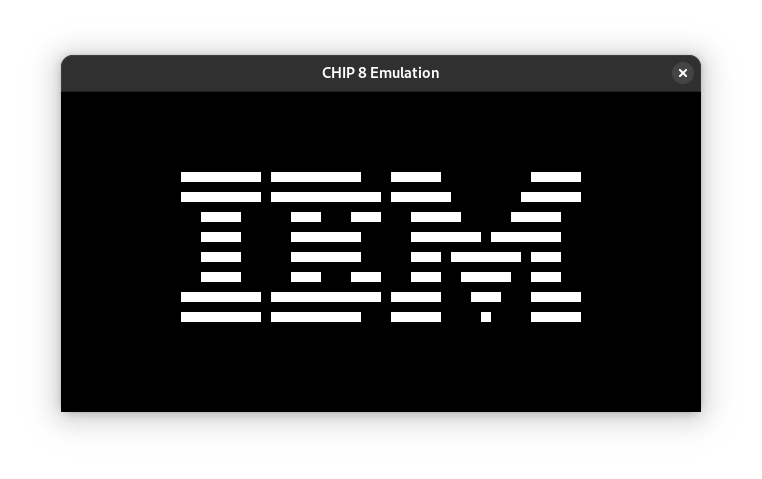

# A CHIP8 emulator in C

This a CHIP8 emulator written in C. It uses
[raylib](https://www.raylib.com/) to render CHIP8 display.



## Build and run
```bash
$ make
$ ./chip8 ./roms/IBM_Logo.ch8
```

## Features
  * [x] Draw the display
  * [x] Can run simple roms
  * [ ] Beep sound
  * [ ] Keyboard input
  * [ ] Run more complex roms

## Resources
- [Guide to making a CHIP-8 emulator, by Tobias V. Langhoff](https://tobiasvl.github.io/blog/write-a-chip-8-emulator/)
